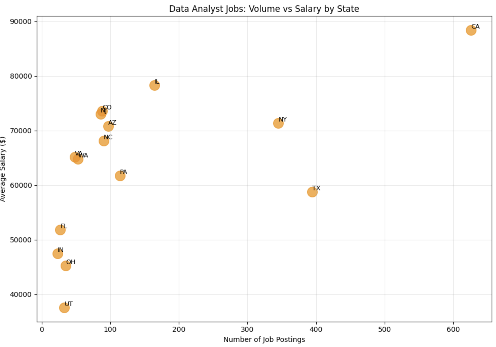
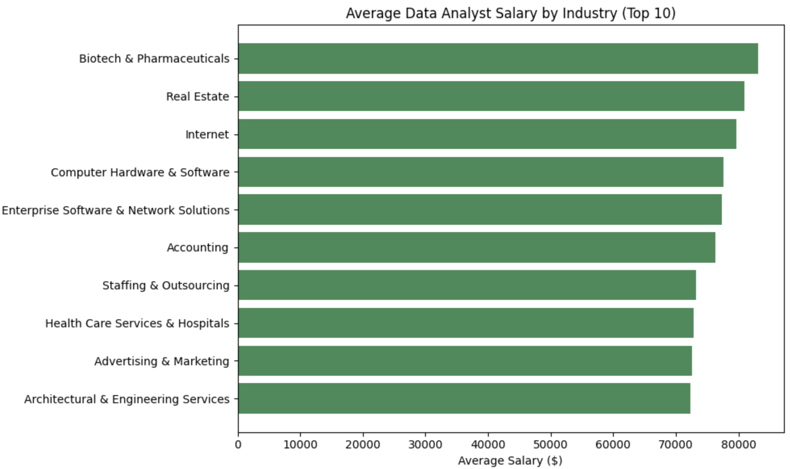
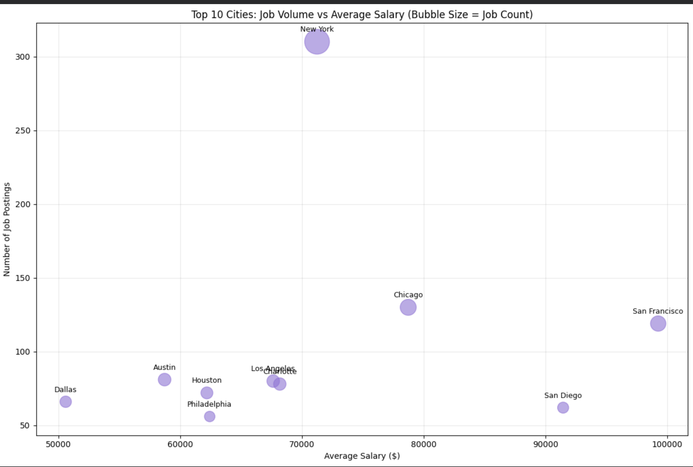

# data-analyst-jobs-market-analysis
## What I looked at

- How much your job title affects what you get paid
- Which industries pay data analysts the most
- Which states and cities offer the best combination of salary and opportunity
- Where the most data analyst jobs are actually concentrated

## Tools used

- **Python / pandas** — data cleaning and preprocessing
- **SQLite** — storing and querying the dataset
- **Matplotlib** — exploratory visualizations
- **Tableau** — interactive dashboard
- **Google Colab** — development environment
- **Kaggle** — data source

## What I found

Honestly the title gap surprised me the most. Lead and Senior analysts earn 10-15% more than someone with the plain "Data Analyst" title, which is a meaningful difference for essentially the same type of work.

California dominates on salary — averaging $88K, nearly $10K ahead of Illinois in second place. Texas has a ton of job postings but pays significantly less, which is worth knowing if you're deciding where to look.

Biotech and Pharmaceuticals came out on top by industry at $83K average. Even the lowest paying industries in the top 10 still averaged over $72K, which suggests the field pays reasonably well across the board.

New York has by far the most job openings at 310 postings, but if salary is the priority, San Francisco averages close to $100K — the tradeoff is there are fewer openings.

## Key Stats

| Metric | Value |
|--------|-------|
| Total Job Postings Analyzed | 2,253 |
| Average Data Analyst Salary | $72,585 |
| Highest Paying State | California ($88,432) |
| City with Most Openings | New York (310) |

## Interactive Dashboard

[View the full Tableau dashboard here](https://public.tableau.com/app/profile/marti.pineda/viz/DataAnalystJobMarketAnalysis_17902732483610/DataAnalystJobMarketAnalysis#1)

## Charts

)

## How to run it

Open the notebook in Colab using the button above — it pulls the dataset directly from GitHub so there's nothing to install or set up locally.
